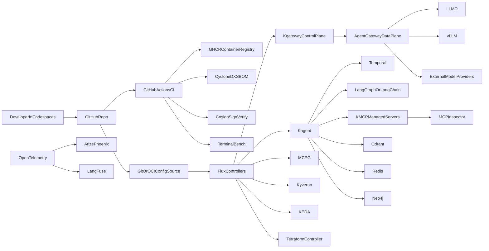

# AI Infrastructure Design (Codespaces + Kubernetes) — All Tools in Core

## 1) Goals and Constraints
- Build a production-ready AI Reliability Engineering baseline in GitHub Codespaces.
- Treat all listed tools as Core scope from day one.
- Preserve low-cost developer workflow while keeping migration path to managed Kubernetes.
- Organize delivery for true parallel execution across multiple agents/teams.

## 2) Core Tool Inventory (Mandatory)

### AI Gateway and Inference
- Agent Gateway (L8-aware data plane, MCP protocol, telemetry)
- Kgateway (Kubernetes-native gateway control plane)
- LLMD (local model inference, CPU-friendly scenarios)
- vLLM (high-throughput inference runtime)
- arXiv (research input for model architecture decisions)

### Guard Rails, Security, and Policy
- MCPG (MCP governance and risk scoring)
- Kyverno (admission policies, image and SBOM verification)
- Cosign (artifact signing and signature verification)

### Gitless Ops, CI/CD, and Lifecycle
- Flux (GitOps and OCI-driven reconciliation)
- CycloneDX (SBOM generation and dependency transparency)
- Terraform Controller (infra changes from Kubernetes-native workflows)
- KEDA (event-driven autoscaling)

### Agent Framework and MCP
- Kagent (declarative agent lifecycle on Kubernetes)
- KMCP (MCP server generation and deployment)
- MCP Inspector (local MCP validation and debugging)
- Temporal (durable long-running workflows)
- LangGraph/LangChain (agent logic framework)

### Memory and Context (RAG)
- Qdrant (vector memory and incident memory)
- Redis (fast memory cache + vector support)
- Neo4j (knowledge graph and dependency graph)

### Observability and Continuous Evaluation
- Arize Phoenix (tracing, eval datasets, model quality checks)
- LangFuse (agent tracing and analytics)
- OpenTelemetry (unified telemetry standard)
- Terminal Bench / Terminal Bench Pro (coding-agent benchmark and scoring)

## 3) Target Runtime Architecture

## 4) Repository Strategy
- `.devcontainer/` — Codespaces runtime and post-create bootstrap.
- `infra/bootstrap/` — `make dev`, cluster lifecycle, tool installers.
- `infra/flux/` — Flux sources, kustomizations, environment overlays.
- `infra/gateway/` — Kgateway, Agent Gateway, provider policies/routes.
- `infra/security/` — Kyverno, MCPG, Cosign verify, policy bundles.
- `infra/agents/` — Kagent specs, Temporal workers, LangGraph/LangChain config.
- `infra/mcp/` — KMCP templates, MCP servers, inspector scripts.
- `infra/memory/` — Qdrant/Redis/Neo4j manifests and schemas.
- `infra/observability/` — OTEL collector, Phoenix, LangFuse, dashboards.
- `.github/workflows/` — CI/CD, SBOM, signing, benchmark workflows.

## 5) Parallel Delivery Model (Core)
Six parallel streams with strict ownership boundaries:
- Stream A: Platform Bootstrap (`kind`, Codespaces, base networking/storage)
- Stream B: Gateway and Inference (`kgateway`, Agent Gateway, LLMD, vLLM)
- Stream C: Agent and MCP Runtime (`Kagent`, `KMCP`, `MCP Inspector`, `Temporal`, `LangGraph/LangChain`)
- Stream D: Security and Governance (`MCPG`, `Kyverno`, `Cosign`)
- Stream E: Data Memory Layer (`Qdrant`, `Redis`, `Neo4j`)
- Stream F: Observability and Evaluation (`OTEL`, `Phoenix`, `LangFuse`, `Terminal Bench`)

Integration contracts (mandatory before merge):
- `RouteSpec` between kgateway and Agent Gateway.
- `ModelRoutePolicy` between Agent Gateway and model providers.
- `ToolSpec` between Kagent and MCP servers.
- `MemoryContract` for Qdrant/Redis/Neo4j adapters.
- `TraceSchema` for OTEL -> Phoenix/LangFuse.
- `PolicySet` for Kyverno/MCPG/Cosign CI gates.

## 6) Lifecycle and Operational Controls
- Gitless Ops: Flux reconciles configs from Git and/or OCI sources.
- SBOM and signing: CycloneDX + Cosign enforced pre-deploy.
- Policy enforcement: Kyverno admission + MCPG scoring.
- Autoscaling: KEDA signals from queue depth, latency, and custom metrics.
- Infra provisioning: Terraform Controller for shared dependencies.
- Quality loop: Phoenix/LangFuse traces + evals + Terminal Bench regression checks.

## 7) Definition of Done (All-Core)
- One-command bootstrap in Codespaces provisions all Core control planes.
- Agent can perform LLM inference + MCP tool call + memory read/write.
- Security gates (Kyverno/MCPG/Cosign/SBOM) are passing in CI.
- OTEL traces visible in Phoenix and LangFuse.
- Autoscaling, rollback, and incident runbooks verified in staging.
